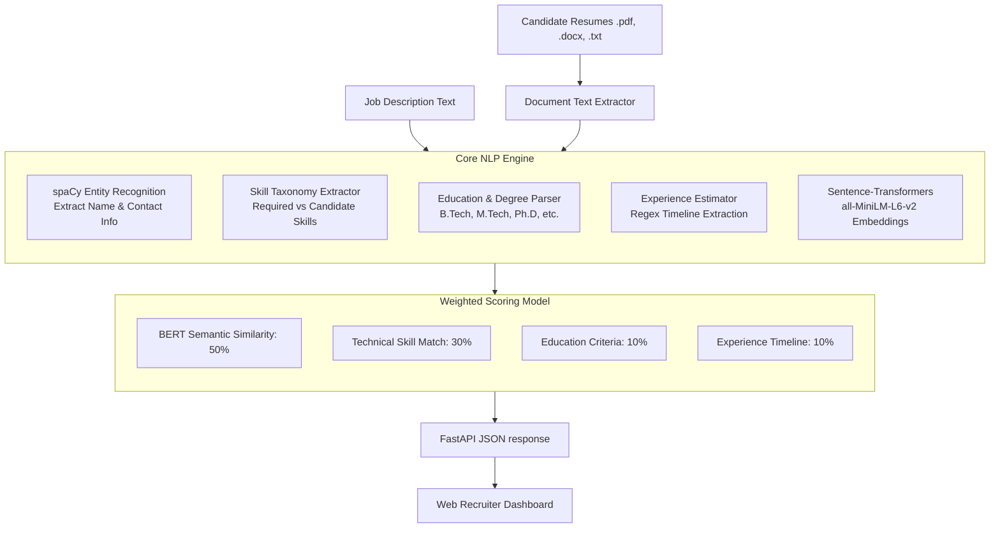

# Intelligent NLP-Driven Candidate Screening and Resume Ranking Framework

An automated HR recruiting pipeline leveraging transformer-based Natural Language Processing (NLP) models to parse resumes, extract key profiles, and semantically rank candidates against job descriptions in real time.

This project features a robust **Python FastAPI backend** executing a hybrid NLP evaluation system, alongside a premium **Vanilla HTML/CSS/JS Recruiter Dashboard** built with custom glassmorphic styling, responsive grids, and detailed analysis visuals.

---

## System Architecture



---

## Key Features

1. **Multi-Format Text Extraction**: Full support for extracting text from PDFs (`pypdf`), Word Documents (`python-docx`), and plain text files.
2. **Hybrid Evaluation Algorithm**: Combining deep learning semantic understanding with precise heuristics:
   - **Semantic Similarity (BERT)**: Utilizes the Hugging Face `all-MiniLM-L6-v2` transformer model to calculate cosine similarity between the resume text and the job description, capturing matching context and responsibilities even when different terms are used.
   - **Skill Extraction (spaCy & Regex)**: Scans documents against a comprehensive tech-skill taxonomy to compute keyword overlap.
   - **Academic & Experience Checkers**: Extracts academic credentials (e.g., M.Tech, B.Tech, Ph.D.) and timelines of experience to match against the job constraints.
3. **Semantic Highlight Extraction**: Evaluates resume sentences individually against the job description to highlight the top three sentences with the highest semantic similarity, allowing recruiters to instantly see why a candidate was ranked highly.
4. **Recruiter Dashboard**: A responsive, modern user interface featuring:
   - Drag-and-drop file uploader.
   - Candidate ranking table sorting candidates by match percentage.
   - Gold/silver/bronze badges highlighting the top three candidates.
   - Slide-over detail panel showing a radar-like score breakdown, contact information, matched vs. missing skills, and semantic context highlights.
5. **1-Click Demo Mode**: Ready-to-go test data allowing the user to experience the full end-to-end NLP execution immediately with a single click.

---

## Technology Stack

- **Backend**: Python, FastAPI, Uvicorn, Pydantic
- **NLP Models**: Hugging Face Sentence-Transformers (`all-MiniLM-L6-v2`), spaCy (`en_core_web_sm`)
- **Document Parsers**: `pypdf`, `python-docx`
- **Frontend**: Vanilla HTML5, Vanilla CSS3 (custom CSS variables, glassmorphism, responsive grid, animations), Vanilla JavaScript (fetch API, event listeners, dynamic UI manipulation)

---

## Directory Structure

```
├── app/
│   ├── __init__.py
│   ├── main.py            # FastAPI Application routes & endpoints
│   ├── nlp_engine.py      # Core NLP parsing & comparison logic
│   └── models.py          # Pydantic serialization schemas
├── static/
│   ├── index.html         # Web UI Recruiter Dashboard
│   ├── css/
│   │   └── style.css      # Premium Dark CSS Stylesheet
│   └── js/
│       └── app.js         # Interface logic & API call management
├── data/
│   ├── resumes/           # Sample candidate resume files
│   └── job_descriptions/  # Sample job requirements
├── tests/
│   └── verify.py          # Automated NLP module tests
├── requirements.txt       # Python dependency checklist
├── run.py                 # Startup script
└── README.md              # Documentation
```

---

## Installation & Running

### Prerequisites
Make sure you have **Python 3.8+** installed on your system.

### 1. Clone & Navigate
Place the files into your workspace directory:
```bash
cd projects/aiml
```

### 2. Install Dependencies
Install the required packages using pip:
```bash
pip install -r requirements.txt
```

### 3. Launch the Server
Start the pipeline using the included runner script, which automatically verifies spaCy dependencies and boots the Uvicorn server:
```bash
python run.py
```

The server will initialize and download the `all-MiniLM-L6-v2` transformer model (approx. 80MB) and spaCy's English model if they are not already cached.

### 4. Access the Dashboard
Once the console prints `Application startup complete.`, open your browser and navigate to:
```text
http://127.0.0.1:8000
```

---

## Scoring Math

The final match score is a weighted combination calculated as:

$$\text{Overall Score} = (0.50 \times \text{Semantic BERT Score}) + (0.30 \times \text{Skill Score}) + (0.10 \times \text{Education Score}) + (0.10 \times \text{Experience Score})$$

- **Semantic Score (50%)**: Cosine similarity between job description and resume embeddings.
- **Skill Score (30%)**: Percentage of job-required skills found in candidate's profile.
- **Education Score (10%)**: Matching academic qualifications (e.g. candidate degree meets or exceeds JD requirements).
- **Experience Score (10%)**: Extracted candidate timeline versus JD requirements.
